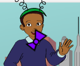

## دوران ربطة العنق

دعونا نبرمج ربطة العنق تدور عند النقر عليها.

--- task ---

افتح مشروع Scratch للبدء.

**على الإنترنت**: افتح مشروع البدء [](http://rpf.io/tech-toys-on){:target="_blank"}.

اذا كنت تملك حساب على منصة السكراتش (Scratch) فيمكنك عمل نسخة بالضغط على **Remix**.

**دون اتصال**: افتح مشروع البدء [](http://rpf.io/p/en/tech-toys-go){:target="_blank"} في المحرر دون اتصال.

اذا تحتاج تنزيل وتنصيب برنامج السكراتش Scratch على جهازك الشخصي، ستجده في [rpf.io/scratchoff](http://rpf.io/scratchoff){:target="_blank"}.

في المشروع المبدئي، يجب أن ترى كائنين حاسوبا محمولا وطائرة عامودية.


--- /task ---

--- task ---

انقر على كائن "ربطة العنق" وأضف هذا الكود:


```blocks3
when this sprite clicked
repeat (10)
turn cw (15) degrees
end
```

--- /task ---


--- task ---

انقر فوق ربطة العنق لتشغيل التعليمية البرمجية الخاص بك. يجب أن ترى أن ربطة العنق الخاص بك تدور ١٥ درجة باتجاه عقارب الساعة لـ ١٠ مرات، حيث تستغرق ١٥٠ درجة في المجموع.



--- /task ---

--- task ---

ابحث عن التعليمة البرمجية`اتجه نحو الاتجاه`{:class="block3motion"} و _اجعل وضع السحب غير قابل للسحب _، انقر عليها لضبط ربطة العنق مرة أخرى إلى موضع البداية.

```blocks3
point in direction (90 v)
```

نصيحة: في سكراتش يمكنك النقر على التعليمة البرمجية لتشغيلها على الفور. لا تحتاج حتى إلى سحبه بالبداية إلى منطقة تنفيذ التعليمة البرمجية!

--- /task ---

--- task ---

لجعل ربطة العنق تدور دورة كاملة، تحتاج أن تكون الأرقام في التعليمات البرمجية الخاصة بك أن تجمع إلى 360 درجة. قم بتغيير التعليمات البرمجية الخاصة بك بحيث تدور ربطة العنق `٣٦` درجة ١٠ مرات (٣٦٠ = ١٠×٣٦).


```blocks3
when this sprite clicked
repeat (10)
+turn cw (36) degrees
end
```

--- /task ---

--- task ---

اختبر التعليمة البرمجية الخاصة بك مرة أخرى. هذه المرة ، يجب أن تقوم ربطة العنق الخاصة بك بدورة ٣٦٠ درجة كاملة وتنتهي في المكان الذي بدأت فيه.

--- /task ---

إذا كنت تريد ربطة العنق الخاص بك للقيام باربعة دورات كاملة، يمكنك تغيير الرقم في التعليمة البرمجية`كرر`{:class="block3control"} من `١٠` إلى `٤٠`.

```blocks3
when this sprite clicked
+repeat (40)
turn cw (36) degrees
end
```
