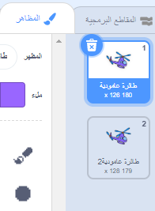

## تشغيل طائرتك العمودية

دعونا نبرمج طائرتك العامودية لتبدأ العمل عند النقر على حاسوبك المحمول.

--- task ---

لنبدأ ببث رسالة `بدء`{:class="block3events"} عند النقر على حاسوبك المحمول. ستحتاج إلى إنشاء `رسالة جديدة` تسمى `ابدأ`.


```blocks3
when this sprite clicked
start sound (computer beeps1 v)
broadcast (start v)
```

هذه التعليمة البرمجية تبث رسالة إلى جميع الكائنات الأخرى. إذا قمت باختبار هذه التعليمة البرمجية، سترى أنه لا شيء يحدث بعد! هذا لأنك لم تقم ببرمجة الطائرة العمودية للرد على الرسالة.

--- /task ---

--- task ---

انقر على كائن الطائرة العمودية الخاصة بك وقم باضافة الكتلة ` عندما اتلقى`{:class="block3events"}. سيتم تنفيذ أي تعليمة برمجية مرتبط بهذه التعليمة عندما تتلقى رسالة 'ابدأ' من حاسبوك المحمول.


```blocks3
when I receive [start v]
```

--- /task ---

--- task ---

إذا قمت بالضغط على علامة التبويب 'المظاهر ' الخاصة بالطائرة العامودية الخاصة بك، ستلاحظ أن لديها اثنين من المظاهر مع وجود اختلاف قليل بالمراوح.



--- /task ---

--- task ---

يمكنك استخدام المظهرين لتحريك المروحية. أضف هذه التعليمة البرمجية، بحيث تغير المروحية المظاهر إلى الأبد بمجرد تلقيها الرسالة 'ابدأ'.


```blocks3
when I receive [start v]
+forever
next costume
end
```

--- /task ---

--- task ---

اختبر التعليمات البرمجية الخاصة بك بالضغط على كائن الحاسوب المحمول الخاص بك. هل تتحرك مروحية الطائرة العامودية الخاصة بك؟


--- /task ---
