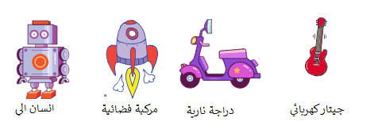

## التحدي: أنشئ لعبة تقنية خاصة بك!
هل يمكنك إنشاء لعبة تقنية خاصة بك؟

يمكنك تحريك الهوائي كلما تم النقر عليهم؟ هنا التعليمات البرمجية التي ستحتاج اليها:


```blocks3
wait (0.1) seconds

turn cw (15) degrees

repeat (10)
end

when this sprite clicked

wait (0.1) seconds

turn ccw (15) degrees
```

يمكنك صنع أي لعبة تقنية تحبها. فيما يلي بعض الكائنات الأخرى التي يمكنك استخدامها:


