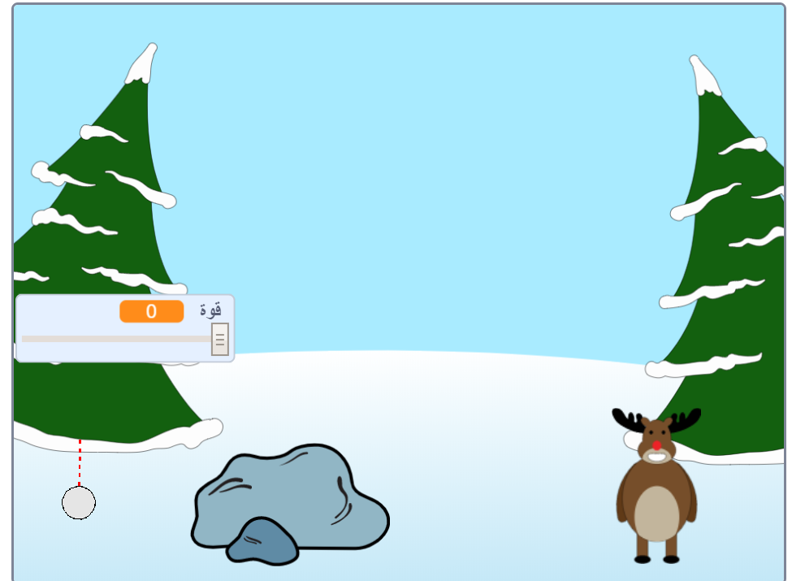

## ما التالي؟

ألق نظرة على مشروع [رمي الكرات الثلجية](https://projects.raspberrypi.org/ar-SA/projects/snowball-fight) في برنامج Scratch.

--- no-print ---

استخدم مؤشر الفأرة لزاوية كرة الثلج واضغط على زر الماوس لاختيار قوة كرة الثلج.

  <iframe allowtransparency="true" width="485" height="402" src="https://scratch.mit.edu/projects/embed/302159331/?autostart=true" frameborder="0" scrolling="no"></iframe>
  

--- /no-print ---

--- print-only ---

--- /print-only ---

***
تمت ترجمة هذا المشروع بواسطة متطوعين:

علي عادل علي

نادية علي قاسم

بفضل المتطوعين ، يمكننا إعطاء الناس في جميع أنحاء العالم فرصة للتعلم بلغتهم الخاصة. يمكنك مساعدتنا في الوصول إلى المزيد من الأشخاص من خلال التطوع للترجمة - مزيد من المعلومات على [rpf.io/translate](https://rpf.io/translate).
