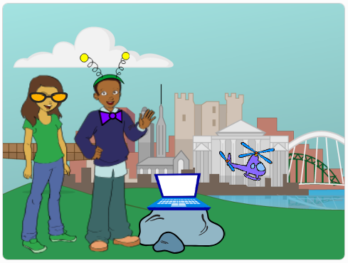

## Rotierende Fliege

Lass uns eine Fliege programmieren, die nach dem Anklicken rotiert.

--- task ---

Öffne das Scratch Start-Projekt.

**Online**: Öffne das [Starter-Projekt](https://scratch.mit.edu/projects/405967449){:target="_blank"}.

Wenn du bereits einen Scratch-Account besitzt, kannst du dir durch Klick auf **Remix** eine Kopie anlegen.

**Offline**: Öffne das [Basisprojekt](http://rpf.io/p/de-DE/tech-toys-go){:target="_blank"} im Offline-Editor.

Wenn du Scratch herunterladen und auf deinem Rechner installieren möchtest, dann findest du die Datei unter diesem Link: [rpf.io/scratchoff](http://rpf.io/scratchoff){:target="_blank"}.

Im Start-Projekt solltest du 2 Figuren, einen Laptop und einen Helikopter, sehen.



--- /task ---

--- task ---

Klicke auf den Sprite mit der Fliege und füge folgenden Code hinzu:


```blocks3
when this sprite clicked
repeat (10)
turn cw (15) degrees
end
```

--- /task ---


--- task ---

Klicke auf die Fliege, um deinen Code auszuführen. Du solltest sehen, dass die Fliege 10 mal um 15 Grad im Uhrzeigersinn, insgesamt 150 Grad, rotiert.


--- /task ---

--- task ---

Finde den `setze Richtung auf`{:class="block3motion"} Block und klicke auf ihn, _ohne ihn in den Skriptbereich zu bewegen_, um die Fliege auf ihre Startposition zurückzusetzen.

```blocks3
point in direction (90 v)
```

Tipp: In Scratch kannst du auf einen Block klicken, um ihn direkt auszuführen. Du musst ihn dafür nicht in den Skriptbereich bewegen!

--- /task ---

--- task ---

Damit die Fliege eine komplette Drehung macht, muss die Summe der Zahlen in deinem Code 360 ergeben. Ändere deinen Code, damit die Fliege sich 10 Mal um `36` Grad dreht (36 x 10 = 360).


```blocks3
when this sprite clicked
repeat (10)
+turn cw (36) degrees
end
```

--- /task ---

--- task ---

Teste deinen Code noch einmal. Dieses Mal sollte die Fliege eine Drehung um 360 Grad machen und da stoppen, wo sie angefangen hat.

--- /task ---

Wenn du möchtest, dass die Fliege 4 ganze Umdrehungen macht, kannst du die Nummer in dem `Wiederholen`{:class="block3control"} Block von `10` auf `40` ändern.

```blocks3
when this sprite clicked
+repeat (40)
turn cw (36) degrees
end
```
