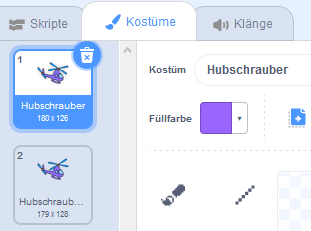

## Starte deinen Hubschrauber

Lass uns deinen Helikopter programmieren, damit er startet, wenn der Laptop angeklickt wird.

--- task ---

Beginnen wir damit, eine `Start`{:class="block3events"} Nachricht zu senden, wenn der Laptop angeklickt wird. Erstelle eine `neue Nachricht` namens `Start`.


```blocks3
when this sprite clicked
start sound (computer beeps1 v)
broadcast (start v)
```

Dieser Code sendet eine Nachricht zu allen anderen Sprites. Wenn du den Code testest wirst du sehen, dass noch nichts passiert! Das liegt daran, dass der Hubschrauber noch keinen Code hat, um auf die Nachricht zu reagieren.

--- /task ---

--- task ---

Klicke auf den Hubschrauber Sprite und füge einen `Wenn ich empfange` Block hinzu. Jeder Code, der an diesen Block angehängt wird, wird ausgeführt, sobald er die 'Start' Nachricht vom Laptop erhält.


```blocks3
when I receive [start v]
```

--- /task ---

--- task ---

Wenn du auf die Registerkarte 'Kostüme' des Hubschraubers klickst, wirst du feststellen, dass er 2 Kostüme mit leicht unterschiedlichen Propellern hat.



--- /task ---

--- task ---

Du kannst die beiden Kostüme benutzen, um den Propeller des Hubschraubers zu bewegen. Füge diesen Code hinzu, damit sich das Kostüm des Hubschraubers endlos ändert, sobald er die 'Start' Nachricht erhält.


```blocks3
when I receive [start v]
+forever
next costume
end
```

--- /task ---

--- task ---

Teste deinen Code indem du auf den Laptop klickst. Bewegen sich die Propeller des Hubschraubers?


--- /task ---
