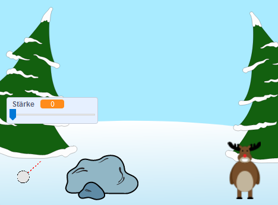

## Wie geht's weiter?

Schau dir das Scratch-Projekt [Schneeballschlacht](https://projects.raspberrypi.org/en/projects/snowball-fight) an.

--- no-print ---

Benutze die Maus, um den Wurfwinkel des Schneeballs festzulegen und halte die Maustaste gedrückt, um mehr Kraft in den Wurf zu legen.

  <iframe allowtransparency="true" width="485" height="402" src="https://scratch.mit.edu/projects/embed/302159331/?autostart=true" frameborder="0" scrolling="no"></iframe>
  

--- /no-print ---

--- print-only ---

--- /print-only ---
