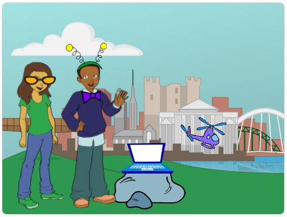

## Περιστροφή του παπιγιόν

Ας γράψουμε κώδικα ώστε το παπιγιόν να περιστρέφεται όταν πατηθεί.

--- task ---

Άνοιξε το αρχικό έργο Scratch.

**Σε σύνδεση**: άνοιξε το [αρχικό έργο](https://scratch.mit.edu/projects/399188696){:target="_blank"}.

Αν έχεις λογαριασμό Scratch μπορείς να κάνεις ένα αντίγραφο, κάνοντας κλικ στο κουμπί **Ανάμειξη**.

**Χωρίς σύνδεση**: άνοιξε το [αρχικό έργο](http://rpf.io/p/el-GR/tech-toys-go){:target="_blank"} στον επεξεργαστή εκτός σύνδεσης.

Αν χρειαστεί να κατεβάσεις και να εγκαταστήσεις τον Scratch επεξεργαστή εκτός σύνδεσης, μπορείς να τον βρεις στο [rpf.io/scratchoff](http://rpf.io/scratchoff){:target="_blank"}.

Στο αρχικό έργο, θα πρέπει να δεις 2 χαρακτήρες, έναν φορητό υπολογιστή και ένα ελικόπτερο.



--- /task ---

--- task ---

Κάνε κλικ στο αντικείμενο «Παπιγιόν» και πρόσθεσε αυτόν τον κώδικα:


```blocks3
when this sprite clicked
repeat (10)
turn cw (15) degrees
end
```

--- /task ---


--- task ---

Κάνε κλικ στο παπιγιόν για να εκτελεστεί ο κώδικάς σου. Θα πρέπει να δεις ότι το παπιγιόν γυρίζει 15 μοίρες δεξιόστροφα 10 φορές, γυρίζοντας συνολικά 150 μοίρες.


--- /task ---

--- task ---

Βρες το μπλοκ `σημείο κατεύθυνσης`{:class="block3motion"} και, _χωρίς να το σύρεις_, κάνε κλικ για να επαναφέρεις το παπιγιόν στην αρχική του θέση.

```blocks3
point in direction (90 v)
```

Συμβουλή: Στο Scratch μπορείς να κάνεις κλικ σε ένα μπλοκ για να το εκτελέσεις αμέσως. Δεν χρειάζεται καν να το σύρεις πρώτα στην περιοχή των σεναρίων!

--- /task ---

--- task ---

Για να κάνεις το παπιγιόν να κάνει 1 πλήρη περιστροφή, οι αριθμοί στον κώδικά σου πρέπει να προσθέσουν έως και 360 μοίρες. Άλλαξε τον κώδικά σου έτσι ώστε το παπιγιόν να γυρίζει `36` μοίρες για 10 φορές (36 x 10 = 360).


```blocks3
when this sprite clicked
repeat (10)
+turn cw (36) degrees
end
```

--- /task ---

--- task ---

Δοκίμασε ξανά τον κώδικά σου. Αυτή τη φορά, το παπιγιόν σου πρέπει να κάνει 1 πλήρη περιστροφή 360 μοιρών και να καταλήξει εκεί που ξεκίνησε.

--- /task ---

Αν θέλεις το παπιγιόν να κάνει 4 πλήρεις περιστροφές, μπορείς να αλλάξεις τον αριθμό στο μπλοκ `επανάληψη`{:class="block3control"} από `10` σε `40`.

```blocks3
when this sprite clicked
+repeat (40)
turn cw (36) degrees
end
```
