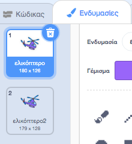

## Ενεργοποίηση του ελικοπτέρου σου

Ας γράψουμε κώδικα ώστε το ελικόπτερο σου να ξεκινήσει όταν κάνεις κλικ στον φορητό υπολογιστή σου.

--- task ---

Ας ξεκινήσουμε μεταδίδοντας ένα μήνυμα `έναρξη`{:class="block3events"} όταν κάνεις κλικ στον φορητό υπολογιστή. Θα πρέπει να δημιουργήσεις ένα `νέο μήνυμα` με όνομα `έναρξη`.


```blocks3
when this sprite clicked
start sound (computer beeps1 v)
broadcast (εκκίνηση v)
```

Αυτός ο κώδικας μεταδίδει ένα μήνυμα σε όλα τα άλλα αντικείμενα. Εάν δοκιμάσεις αυτόν τον κώδικα, θα δεις ότι τίποτα δεν συμβαίνει ακόμα! Αυτό συμβαίνει επειδή δεν έχεις γράψει κώδικα ώστε το ελικόπτερο να ανταποκριθεί στο μήνυμα.

--- /task ---

--- task ---

Κάνε κλικ στο αντικείμενο του ελικοπτέρου σου και πρόσθεσε ένα μπλοκ `Όταν λάβω`{:class="block3events"}. Οποιοσδήποτε κώδικας που επισυνάπτεται σε αυτό το μπλοκ θα εκτελείται όταν λαμβάνει το μήνυμα "έναρξη" από τον φορητό υπολογιστή.


```blocks3
when I receive [εκκίνηση v]
```

--- /task ---

--- task ---

Εάν κάνεις κλικ στην καρτέλα «Ενδυμασίες» του ελικοπτέρου σου, θα παρατηρήσεις ότι έχει 2 ενδυμασίες με ελαφρώς διαφορετικές έλικες.



--- /task ---

--- task ---

Μπορείς να χρησιμοποιήσεις τις 2 ενδυμασίες για να κινήσεις το ελικόπτερο. Πρόσθεσε αυτόν τον κώδικα, έτσι ώστε το ελικόπτερο να αλλάζει ενδυμασίες για πάντα μόλις λάβει το μήνυμα "έναρξη".


```blocks3
when I receive [εκκίνηση v]
+forever
next costume
end
```

--- /task ---

--- task ---

Δοκίμασε τον κώδικα σου κάνοντας κλικ στον φορητό υπολογιστή. Η έλικα του ελικοπτέρου σου κινείται;


--- /task ---
