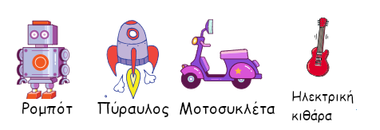

## Πρόκληση: Δημιούργησε το δικό σου παιχνίδι τεχνολογίας!
Μπορείς να δημιουργήσεις το δικό σου παιχνίδι τεχνολογίας;

Θα μπορούσες να κάνεις τις κεραίες να κινούνται κάθε φορά που τις κάνουμε κλικ; Εδώ είναι ο κώδικας που θα χρειαστεί να χρησιμοποιήσεις:


```blocks3
wait (0.1) seconds

turn cw (15) degrees

repeat (10)
end

when this sprite clicked

wait (0.1) seconds

turn ccw (15) degrees
```

Θα μπορούσες να φτιάξεις οποιοδήποτε παιχνίδι τεχνολογίας σου αρέσει. Εδώ είναι μερικά άλλα αντικείμενα που θα μπορούσες να χρησιμοποιήσεις:


