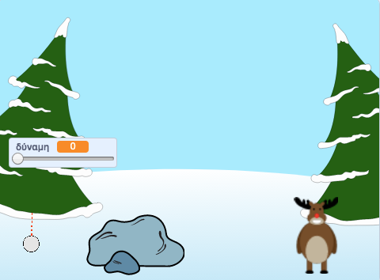

## Και μετά;

Ρίξε μια ματιά στο έργο Scratch [Χιονοπόλεμος](https://projects.raspberrypi.org/el-GR/projects/snowball-fight).

--- no-print ---

Χρησιμοποίησε το δείκτη του ποντικιού για γωνία της χιονόμπαλας και κράτησε πατημένο το κουμπί του ποντικιού για να επιλέξεις τη δύναμη της χιονόμπαλας.

  <iframe allowtransparency="true" width="485" height="402" src="https://scratch.mit.edu/projects/embed/399189528/?autostart=true" frameborder="0" scrolling="no"></iframe>
  

--- /no-print ---

--- print-only ---

--- /print-only ---

***
Το έργο αυτό μεταφράστηκε από τους εθελοντές:

Ευστάθιος Ιωσηφίδης

Κυριακή Ιντζεΐδου

Χάρη στους εθελοντές, μπορούμε να δώσουμε σε ανθρώπους σε όλο τον κόσμο την ευκαιρία να μάθουν στη γλώσσα τους. Μπορείτε να μας βοηθήσετε να προσεγγίσουμε περισσότερους ανθρώπους μεταφράζοντας εθελοντικά - περισσότερες πληροφορίες στο [rpf.io/translate](https://rpf.io/translate).
