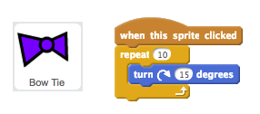
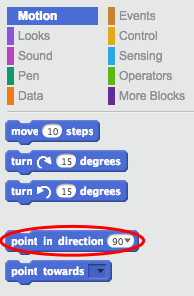
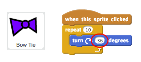

## Spinning Bow Tie

Let's code a bow tie that spins when clicked.

+ Open the 'Tech Toys' Scratch project. Your club leader will give you a copy of this project, or you can open it online at <a href="http://jumpto.cc/toys-go" target="_blank">jumpto.cc/toys-go</a>.

+ Click on the 'Bow Tie' sprite and add this code:

	

+ Click the bow tie to run your code. You should see that your bow tie turns 15 degrees clockwise 10 times, turning 150 degrees in total.

	

+ Find the `point in direction`{:class="blockmotion"} block and, _without dragging it_, click it to set the bow tie back to its starting position.

	
	
	Tip: In Scratch you can click on a block to run it straight away. You don't even need to drag it onto the scripts area first!

+ To make the bow tie do 1 complete spin, the numbers in your code need to add up to 360 degrees. Change your code so that the bow tie turns 36 degrees 10 times (36 x 10 = 360).

	

+ Test your code again. This time, your bow tie should do 1 complete 360 degree spin and end up where it started.

+ If you want your bow tie to do 4 complete spins, you can change the number in the `repeat`{:class="blockcontrol"} block from 10 to 40.

	

