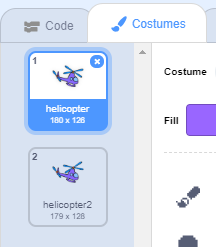

## Powering up your helicopter

Let's code your helicopter to start up when your laptop is clicked.

+ Let's start by broadcasting a `start`{:class="blockevents"} message when the laptop is clicked. You'll need to create a `new message` called `start`.

	

+ Your code should look like this:  

	

	This code broadcasts a message to all other sprites. If you test this code, you'll see that nothing happens yet! This is because you've not coded the helicopter to respond to the message.

+ Click on your helicopter sprite and add a `When I receive`{:class="blockevents"} block. Any code attached to this block will be run when it receives the 'start' message from the laptop.

	

+ If you click your helicopter's 'Costumes' tab, you'll notice that it has 2 costumes with slightly different propellers.

	

+ You can use the 2 costumes to animate the helicopter. Add this code, so that the helicopter changes costumes forever once it receives the 'start' message.

	

+ Test your code by clicking your laptop sprite. Does your helicopter's propeller animate?

	

