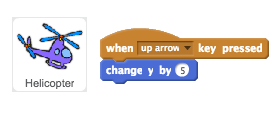
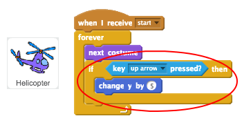
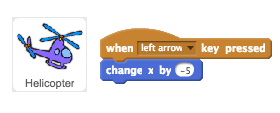
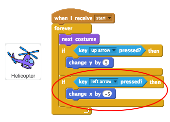

## Flying your helicopter

Let's use the arrow keys to fly your helicopter.

+ Let's start by coding your helicopter to move up when the up arrow is pressed.

	

+ Test your code and you'll see that your helicopter's __y__ position (up/down) changes whenever the up arrow is pressed.

+ If you want your helicopter to move more smoothly, you can instead add code to move upwards inside your helicopter's `forever`{:class="blockcontrol"} loop.

	

+ If you test this new code, you'll see that the movement is smoother than before.

+ You can also code your helicopter to move to the left when the left arrow is pressed. This time you'll need to change the helicopter's __x__ postition by __-5__.

	

+ For smoother motion, you can instead add more code to your helicopter's `forever`{:class="blockcontrol"} loop.

	

