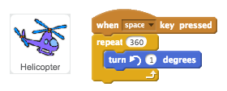
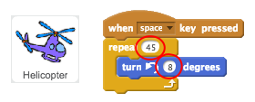
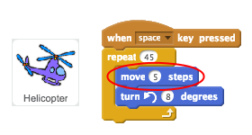

## Loop-the-loop

Let's code your helicopter to do a 360 degree spin.

+ We want the helicopter to do a 360 degree spin whenever the space key is pressed. Remember that the numbers in your code need to add up to 360.

	

+ Test your code by pressing space, and you'll see that your helicopter spins very slowly. That's because it only turns 1 degree 360 times.

+ To speed up your helicopter's spin, change the numbers in your code so that it turns more degrees fewer times. It doesn't matter what numbers you choose as long as they add up to 360!

	

+ If you want your helicopter to move as well as spin, just add a `move`{:class="blockmotion"} block to your code.

	

+ Press space again to test your code. You should see your helicopter move in a circle. What happens if you change the number in your `move`{:class="blockmotion"} block?

 	

