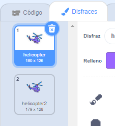

## Enciende tu helicóptero

Let's code your helicopter to start up when your laptop is clicked.

--- task ---

Empecemos por transmitir el mensaje `iniciar`{:class="block3events"} cuando se haga clic en el portátil. Necesitarás crear un `nuevo mensaje` que se llame `iniciar`.


```blocks3
when this sprite clicked
start sound (computer beeps1 v)
broadcast (start v)
```

Este código transmite un mensaje a todos los demás objetos. Si pruebas este código, ¡verás que aún no pasa nada! Esto es porque no has codificado el helicóptero para que responda al mensaje.

--- /task ---

--- task ---

Haz clic en el objeto helicóptero y añade un bloque `Al recibir`{:class="block3events"}. Cualquier código adjunto a este bloque se ejecutará cuando reciba el mensaje «iniciar» desde el notebook.


```blocks3
when I receive [start v]
```

--- /task ---

--- task ---

If you click your helicopter's 'Costumes' tab, you'll notice that it has 2 costumes with slightly different propellers.



--- /task ---

--- task ---

Puedes utilizar los 2 disfraces para animar el helicóptero. Añade este código, para que el helicóptero cambie el disfraz para siempre cuando reciba el mensaje de «iniciar».


```blocks3
when I receive [start v]
+forever
next costume
end
```

--- /task ---

--- task ---

Prueba tu código al hacer clic en el objeto notebook. ¿Se puede animar la hélice de tu helicóptero?


--- /task ---
