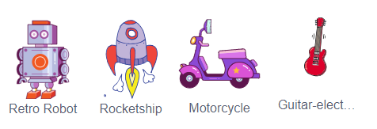

## Desafío: ¡Crea tu propio juguete electrónico!
¿Puedes crear tu propio juguete electrónico?

¿Podrías hacer que las antenitas se muevan cada vez que se haga clic en ellas? Aquí están los bloques de código que necesitarás:


```blocks3
wait (0.1) seconds

turn cw (15) degrees

repeat (10)
end

when this sprite clicked

wait (0.1) seconds

turn ccw (15) degrees
```

Podrías hacer cualquier juguete electrónico que quieras. Aquí tienes otros objetos que puedes usar:


