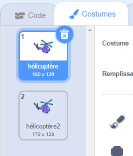

## Mettre ton hélicoptère sous tension

Codons ton hélicoptère pour démarrer quand ton ordinateur portable est cliqué.

--- task ---

Commençons par diffuser un message `démarrer`{:class="block3events"} lorsque l'ordinateur portable est cliqué. Tu devras créer un `nouveau message` appelé `démarrer`.


```blocks3
when this sprite clicked
start sound (computer beeps1 v)
broadcast (start v)
```

Ce code diffuse un message à tous les autres sprites. Si tu testes ce code, tu verras que rien ne se passe encore ! C'est parce que tu n'as pas codé l'hélicoptère pour répondre au message.

--- /task ---

--- task ---

Clique sur ton sprite hélicoptère et ajoute un bloc `Quand je reçois`{:class="block3events"}. N'importe quel code attaché à ce bloc sera exécuté quand il recevra le message « démarrer » de l'ordinateur portable.


```blocks3
when I receive [start v]
```

--- /task ---

--- task ---

Si tu clique sur l'onglet « Costumes » de ton hélicoptère, tu remarqueras qu'il a 2 costumes avec des hélices légèrement différentes.



--- /task ---

--- task ---

Tu peux utiliser les 2 costumes pour animer l'hélicoptère. Ajoute ce code, de sorte que l'hélicoptère change de costumes pour toujours une fois qu'il reçoit le message « démarrer ».


```blocks3
when I receive [start v]
+forever
next costume
end
```

--- /task ---

--- task ---

Teste ton code en cliquant sur ton sprite ordinateur portable. Est-ce que l'hélice de ton hélicoptère s'anime ?


--- /task ---
