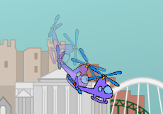

## Faire un looping

Codons ton hélicoptère pour qu'il fasse une rotation de 360 degrés.

--- task ---

Nous voulons que l’hélicoptère effectue une rotation de 360 degrés chaque fois que l'on appuie sur la touche espace. Rappelle-toi que les chiffres dans ton code doivent totaliser 360.


```blocks3
when [space v] key pressed
repeat (360)
turn ccw (1) degrees
end
```

--- /task ---

--- task ---

Teste ton code en appuyant sur l'espace, et tu verras que ton hélicoptère tourne très lentement. C'est parce qu'il ne tourne que de 1 degré 360 fois.

--- /task ---

--- task ---

Pour accélérer la rotation de ton hélicoptère, modifie les chiffres dans ton code pour qu'il tourne plus de degrés moins de fois. Peu importe les nombres que tu choisis tant qu'ils totalisent 360!


```blocks3
when [space v] key pressed
+repeat (45)
+turn ccw (8) degrees
end
```

--- /task ---

--- task ---

Si tu veux que ton hélicoptère se déplace aussi bien qu'il tourne, il suffit d'ajouter un bloc `avancer`{:class="block3motion"} à ton code.

```blocks3
when [space v] key pressed
repeat (45)
+ move (5) steps
turn ccw (8) degrees
end
```

--- /task ---

--- task ---

Appuie à nouveau sur espace pour tester ton code. Tu devrais voir ton hélicoptère se déplacer en cercle. Que se passe-t-il si tu changes le nombre dans ton bloc `avancer`{:class="block3motion"}?



--- /task ---

