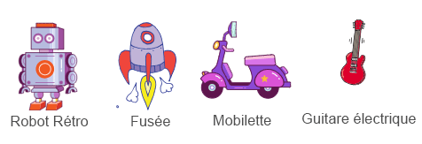

## Défi : créer ton propre jouet technologique !
Peux-tu créer ton propre jouet technologique ?

Tu pourrais faire bouger l'antenne à chaque fois qu'elle est cliquée ? Voici les blocs de code dont tu as besoin :


```blocks3
wait (0.1) seconds

turn cw (15) degrees

repeat (10)
end

when this sprite clicked

wait (0.1) seconds

turn ccw (15) degrees
```

Tu pourrais faire n'importe quel jouet technologique que tu aimes. Voici quelques autres sprites que tu pourrais utiliser :


