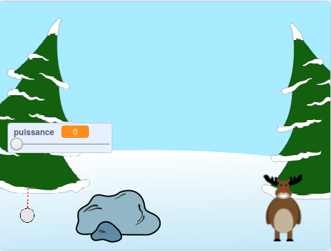

## Et ensuite ?

Jette un œil au Projet Scratch [Bataille de boules de neige](https://projects.raspberrypi.org/en/projects/snowball-fight).

--- no-print ---

Utilise le pointeur de la souris pour incliner la boule de neige et maintiens le bouton de la souris enfoncé pour choisir la puissance de la boule de neige.

  <iframe allowtransparency="true" width="485" height="402" src="https://scratch.mit.edu/projects/embed/302159331/?autostart=true" frameborder="0" scrolling="no"></iframe>
  

--- /no-print ---

--- print-only ---

--- /print-only ---
