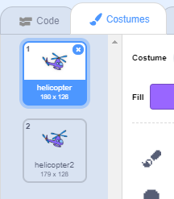

## हेलीकॉप्टर को चालू करना

जब आपका लैपटॉप क्लिक किया जाता है, तो अपने हेलीकॉप्टर को शुरू करने के लिए कोड लिखिए।

--- task ---

चलो शुरू करें, लैपटॉप पर क्लिक करने पर `start`{:class="block3events"} संदेश को प्रसारित (broadcast) करें। आपको एक `start` नामक `नया संदेश (New Message)` बनाना होगा।


```blocks3
when this sprite clicked
start sound (computer beeps1 v)
broadcast (start v)
```

यह कोड अन्य सभी स्प्राइट्स के लिए एक संदेश प्रसारित करता है। यदि आप इस कोड का परीक्षण करते हैं, तो आप देखेंगे कि अभी तक कुछ नहीं हुआ है! यह इसलिए है क्योंकि आपने संदेश का जवाब देने के लिए हेलीकॉप्टर में कोड नहीं जोड़ा है।

--- /task ---

--- task ---

अपने हेलीकॉप्टर स्प्राइट पर क्लिक करें और एक `When I receive`{:class="block3events"} ब्लॉक को जोड़ें। इस ब्लॉक से जुड़ा कोई भी कोड तब चलाया जाएगा जब उसे लैपटॉप से 'start' संदेश प्राप्त होगा।


```blocks3
when I receive [start v]
```

--- /task ---

--- task ---

यदि आप अपने हेलीकॉप्टर के 'Costumes' टैब पर क्लिक करते हैं, तो आप देखेंगे कि इसमें 2 costumes हैं जो थोड़े अलग हैं।



--- /task ---

--- task ---

आप हेलीकॉप्टर को एनिमेट करने के लिए इन 2 कॉस्ट्यूम्स का उपयोग कर सकते हैं। इस कोड को जोड़ें, ताकि हेलीकॉप्टर कॉस्ट्यूम को हमेशा के लिए बदल दे जब 'start' संदेश प्राप्त हों।


```blocks3
when I receive [start v]
+forever
next costume
end
```

--- /task ---

--- task ---

लैपटॉप स्प्राइट पर क्लिक करके अपने कोड का परीक्षण करें। क्या आपके हेलिकॉप्टर का प्रोपेलर एनिमेट होता है?


--- /task ---
