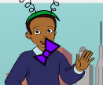

## Papillon rotante

Scriviamo il codice per faccia girare il papillon quando viene cliccato.

--- task ---

Apri il progetto iniziale di Scratch.

**Online**: apri il [progetto iniziale](http://rpf.io/tech-toys-on){:target="_blank"}.

Se hai un account su Scratch, puoi farne una copia cliccando su **Remix**.

**Offline**: apri il [progetto iniziale ](http://rpf.io/p/it-IT/tech-toys-go){:target="_blank"} nell'editor offline.

Se hai bisogno di scaricare ed installare l'editor Scratch offline, puoi trovarlo su [rpf.io/scratchoff](http://rpf.io/scratchoff){:target="_blank"}.

Nel progetto iniziale, dovresti vedere 2 personaggi, un laptop e un elicottero.


--- /task ---

--- task ---

Fai clic sullo sprite "Papillon" e aggiungi questo codice:


```blocks3
when this sprite clicked
repeat (10)
turn cw (15) degrees
end
```

--- /task ---


--- task ---

Fai clic sul papillon per eseguire il codice. Dovresti vedere il tuo papillon girare di 15 gradi in senso orario 10 volte, ruotando in totale di 150 gradi.



--- /task ---

--- task ---

Trova il `punto in direzione`{:class="block3motion"} e _senza trascinarlo_, fai clic per riportare il papillon nella posizione iniziale.

```blocks3
point in direction (90 v)
```

Suggerimento: in Scratch puoi fare clic su qualunque blocco per eseguirlo immediatamente. Non hai nemmeno bisogno di trascinarlo prima nell'area degli script!

--- /task ---

--- task ---

Per far eseguire al papillon 1 giro completo, i numeri nel codice devono sommare 360 gradi. Modifica il codice in modo che il papillon ruoti `36` gradi per 10 volte (36 x 10 = 360).


```blocks3
when this sprite clicked
repeat (10)
+turn cw (36) degrees
end
```

--- /task ---

--- task ---

Prova di nuovo il tuo codice. Questa volta, il tuo papillon dovrebbe fare 1 giro completo di 360 gradi e fermarsi dove ha iniziato.

--- /task ---

Se vuoi che il tuo papillon esegua 4 giri completi, puoi cambiare il numero all'interno del blocco `ripeti`{:class="block3control"} da `10` a `40`.

```blocks3
when this sprite clicked
+repeat (40)
turn cw (36) degrees
end
```
