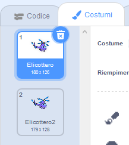

## Accendi l'elicottero

Scriviamo il codice che avvii l'elicottero quando si clicca sul laptop.

--- task ---

Iniziamo trasmettendo un messaggio `start`{:class="block3events"} quando il computer portatile viene cliccato. Dovrai creare un `nuovo messaggio` chiamato `start`.


```blocks3
when this sprite clicked
start sound (computer beeps1 v)
broadcast (start v)
```

Questo codice trasmette un messaggio a tutti gli altri sprite. Se provi questo codice, vedrai che non succede ancora nulla! Questo perché non hai scritto il codice che permette all'elicottero di rispondere al messaggio.

--- /task ---

--- task ---

Fai clic sullo sprite dell'elicottero e aggiungi un blocco `quando ricevo` {:class="block3events"}. Qualsiasi codice agganciato a questo blocco verrà eseguito quando riceve il messaggio "start" dal laptop.


```blocks3
when I receive [start v]
```

--- /task ---

--- task ---

Se fai clic sulla scheda "Costumi" del tuo elicottero, noterai che ha 2 costumi con eliche disegnante diversamente.



--- /task ---

--- task ---

Puoi usare i 2 costumi per animare l'elicottero. Aggiungi questo codice, in modo che l'elicottero cambi i costumi per sempre una volta che riceve il messaggio 'start'.


```blocks3
when I receive [start v]
+forever
next costume
end
```

--- /task ---

--- task ---

Metti alla prova il tuo codice facendo clic sullo sprite del laptop. L'elica del tuo elicottero si anima?


--- /task ---
