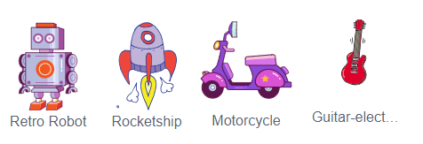

## Sfida: Crea il tuo giocattolo tecnologico!
Riesci a creare il tuo giocattolo tecnologico?

Riesci a far muovere le antenne ogni volta che vengono cliccate? Ecco il codice che dovrai usare:


```blocks3
wait (0.1) seconds

turn cw (15) degrees

repeat (10)
end

when this sprite clicked

wait (0.1) seconds

turn ccw (15) degrees
```

Puoi realizzare qualsiasi giocattolo tecnologico che ti piace. Ecco alcuni altri sprite che puoi usare:


