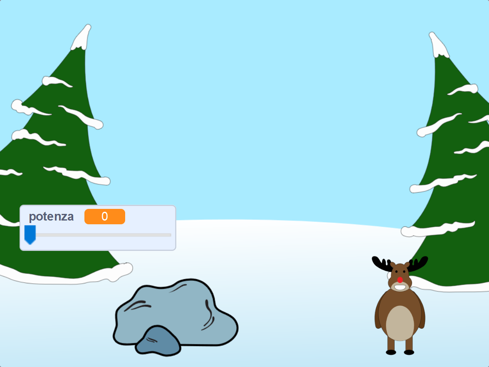

## E adesso?

Dai un'occhiata al progetto Scratch [Battaglia di palle di neve](https://projects.raspberrypi.org/it-IT/projects/snowball-fight).

--- no-print ---

Usa il puntatore del mouse per inclinare la palla di neve e tieni premuto il pulsante del mouse per scegliere la potenza della palla di neve.

  <iframe allowtransparency="true" width="485" height="402" src="https://scratch.mit.edu/projects/embed/302159331/?autostart=true" frameborder="0" scrolling="no"></iframe>
  

--- /no-print ---

--- print-only ---

--- /print-only ---

***
Questo progetto è stato tradotto da volontari:

Stefano Serafini

Omar Lazzari

Grazie ai volontari, possiamo offrire alle persone di tutto il mondo la possibilità di imparare nella loro lingua. Puoi aiutarci a raggiungere più persone offrendoti come volontario per la traduzione - puoi trovare maggiori informazioni su [rpf.io/translate](https://rpf.io/translate).
