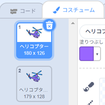

## ヘリコプターを起動する

ラップトップを押したらヘリコプターが起動するようにプログラムを書きましょう。

--- task ---

ラップトップが押されたら、`スタート`{:class="block3events"}メッセージを送ることから始めてみましょう。 `スタート`という`新しいメッセージ`をつくる必要があります。


```blocks3
when this sprite clicked
start sound (computer beeps1 v)
broadcast (start v)
```

このコードは他のすべてのスプライトにメッセージを送ります。 このプログラムを試してみると、まだ何も起こらないことがわかります！ これはヘリコプターがメッセージに反応するようにプログラムを書いてないからです。

--- /task ---

--- task ---

ヘリコプターのスプライトを押して、`(メッセージ1)を受け取ったとき`{:class="block3events"}ブロックを追加します。 このブロックに追加されたすべてのプログラムは、ラップトップから「スタート」メッセージを受け取ったときに実行されます。


```blocks3
when I receive [start v]
```

--- /task ---

--- task ---

ヘリコプターの「コスチューム」タブを押すと、プロペラがちょっとちがう2つのコスチュームがあることがわかるはずです。



--- /task ---

--- task ---

2つのコスチュームを使って、ヘリコプターを動かすことができます。 ヘリコプターが「スタート」メッセージを受け取ったら、2つのコスチュームを切りかえ続けるように次のコードを追加します。


```blocks3
when I receive [start v]
+forever
next costume
end
```

--- /task ---

--- task ---

ラップトップのスプライトを押してプログラムを試します。 ヘリコプターのプロペラは動きますか？


--- /task ---
