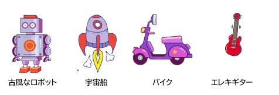

## チャレンジ：自分だけのハイテクおもちゃをつくろう！
自分だけのハイテクおもちゃをつくれますか？

アンテナを押すたびにアンテナを動かすことができますか？ 使う必要があるコードブロックは以下の通りです：


```blocks3
wait (0.1) seconds

turn cw (15) degrees

repeat (10)
end

when this sprite clicked

wait (0.1) seconds

turn ccw (15) degrees
```

You could make any tech toy you like. Here are some other sprites you could use:


