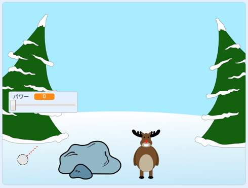

## 次は何をしましょうか？

Scratchプロジェクト[雪合戦](https://projects.raspberrypi.org/en/projects/snowball-fight)を見てください。

--- no-print ---

マウスポインタを利用して雪玉の角度を調整（ちょうせい）し、マウスボタンを押したまま雪玉のパワーを選択します。

  <iframe allowtransparency="true" width="485" height="402" src="https://scratch.mit.edu/projects/embed/302159331/?autostart=true" frameborder="0" scrolling="no"></iframe>
  

--- /no-print ---

--- print-only ---

--- /print-only ---
