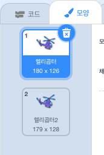

## 헬리콥터 시동 걸기

노트북을 클릭하면 시동이 걸리게 헬리콥터에 코딩해봅시다.

--- task ---

노트북이 클릭되면 `시작`{:class="block3events"} 메시지가 방송되게 하면서 시작해봅시다! `시작`이라는 `새로운 메시지`를 만들어야 합니다.


```blocks3
when this sprite clicked
start sound (computer beeps1 v)
broadcast (시작 v)
```

이 코드는 다른 모든 스프라이트에 메시지를 방송합니다. 이 코드를 테스트해 보면 아직 아무 일도 일어나지 않는다는 것을 알 수 있을 거예요! 왜냐하면 이 메시지에 응답하도록 헬리콥터를 아직 코딩하지 않았기 때문입니다.

--- /task ---

--- task ---

헬리콥터 스프라이트를 클릭하고 `신호를 받았을 때`{:class="block3events"} 블럭을 추가하세요. 이 블록이 사용된 모든 코드는 노트북으로부터 '시작' 메시지를 수신할 때 실행됩니다.


```blocks3
when I receive [시작 v]
```

--- /task ---

--- task ---

헬리콥터의 '모양' 탭을 클릭하면 프로펠러가 약간 다른 두 헬리콥터를 볼 수 있을 것입니다.



--- /task ---

--- task ---

헬리콥터를 움직이게 하기 위해서 2가지 모양을 사용할 수 있습니다. 이 코드를 추가해서 헬리콥터가 '시작' 메시지를 수신하면 영원히 모양이 변경되도록 하세요.


```blocks3
when I receive [시작 v]
+forever
next costume
end
```

--- /task ---

--- task ---

노트북 스프라이트를 클릭해서 코드를 테스트해보세요 헬리콥터 프로펠러가 움직이나요?


--- /task ---
