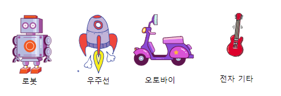

## 도전과제: 나만의 첨단기술 장난감 만들기!
여러분만의 첨단기술 장난감을 만들 수 있나요?

클릭하면 안테나가 움직이게 만들 수 있나요? 여기 필요한 코드 블록입니다:


```blocks3
wait (0.1) seconds

turn cw (15) degrees

repeat (10)
end

when this sprite clicked

wait (0.1) seconds

turn ccw (15) degrees
```

원하는 어떤 첨단기술 장난감이든 만들 수 있습니다. 사용할 수 있는 다른 스프라이트들은 여기 있습니다:


