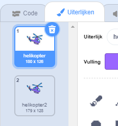

## Je helikopter inschakelen

Laten we je helikopter coderen om op te starten wanneer op je laptop wordt geklikt.

--- task ---

Laten we beginnen met het uitzenden van een `start`{:class="block3events"}-bericht wanneer op de laptop wordt geklikt. Je moet een `nieuw bericht` maken genaamd `start`.


```blocks3
when this sprite clicked
start sound (computer beeps1 v)
broadcast (start v)
```

Deze code zendt een bericht naar alle andere sprites. Als je deze code test, zul je zien dat er nog niets gebeurt! Dit komt omdat je de helikopter niet hebt gecodeerd om op het bericht te reageren.

--- /task ---

--- task ---

Klik op de helikoptersprite en voeg een `Wanneer ik signaal ontvang`{:class="block3events"}-blok toe. Alle code die aan dit blok is gekoppeld, wordt uitgevoerd wanneer het het 'start'-bericht van de laptop ontvangt.


```blocks3
when I receive [start v]
```

--- /task ---

--- task ---

Als je op het tabblad 'Uiterlijken' van de helikopter klikt, zul je zien dat het 2 uiterlijken heeft met iets andere propellers.



--- /task ---

--- task ---

Je kunt de 2 uiterlijken gebruiken om de helikopter te animeren. Voeg deze code toe, zodat de helikopter voor altijd van uiterlijk verandert zodra het het 'start'-bericht ontvangt.


```blocks3
when I receive [start v]
+forever
next costume
end
```

--- /task ---

--- task ---

Test je code door op je laptopsprite te klikken. Animeert de propeller van je helikopter?


--- /task ---
