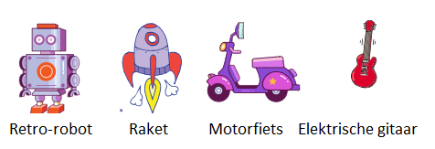

## Uitdaging: maak je eigen tech speelgoed!

Kunt je je eigen tech speelgoed maken?

Je kunt de antenne laten bewegen wanneer er op wordt geklikt? Dit zijn de codeblokken die je nodig hebt:


```blocks3
wait (0.1) seconds

turn cw (15) degrees

repeat (10)
end

when this sprite clicked

wait (0.1) seconds

turn ccw (15) degrees
```

Je zou elk tech speelgoed kunnen maken dat je leuk vindt. Hier zijn enkele andere sprites die je zou kunnen gebruiken:


