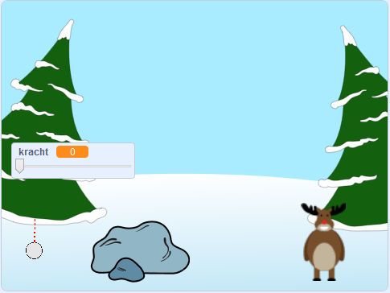

## Wat kun je verder nog doen?

Bekijk het [Sneeuwballengevecht](https://projects.raspberrypi.org/en/projects/snowball-fight) Scratch-project.

--- no-print ---

Gebruik de muisaanwijzer om de sneeuwbal te richten en houd de muisknop ingedrukt om de kracht van de sneeuwbal te kiezen.

  <iframe allowtransparency="true" width="485" height="402" src="https://scratch.mit.edu/projects/embed/302159331/?autostart=true" frameborder="0" scrolling="no"></iframe>
  

--- /no-print ---

--- print-only ---

--- /print-only ---
