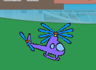

## Uruchamianie twojego helikoptera

Zakodujmy twoj helikopter, aby uruchamiał się po kliknięciu laptopa.

--- task ---

Zacznijmy od wyemitowania komunikatu `start`{:class="block3events"} po kliknięciu laptopa. Musisz utworzyć `nową wiadomość` o nazwie `start`.


```blocks3
when this sprite clicked
start sound (computer beeps1 v)
broadcast (start v)
```

Ten kod wysyła wiadomość do wszystkich innych duszków. Jeśli przetestujesz ten kod, zobaczysz, że jeszcze nic się nie stanie! Dzieje się tak, ponieważ nie zakodowałeś helikoptera do odpowiedzi na wiadomość.

--- /task ---

--- task ---

Kliknij duszka helikoptera i dodaj `Kiedy otrzymam`{:class="block3events"}blok. Jakikolwiek kod dołączony do tego bloku zostanie uruchomiony, gdy otrzyma komunikat "start" z laptopa.


```blocks3
when I receive [start v]
```

--- /task ---

--- task ---

Jeśli klikniesz zakładkę "Kostiumy" swojego helikoptera, zauważysz, że ma 2 kostiumy z nieco różnymi śmigłami.


--- /task ---

--- task ---

Możesz użyć 2 kostiumów do animacji helikoptera. Dodaj ten kod, aby helikopter na zawsze zmieniał kostiumy po otrzymaniu komunikatu „start”.


```blocks3
when I receive [start v]
+forever
next costume
end
```

--- /task ---

--- task ---

Przetestuj swój kod klikając ikonke laptopa. Czy śmigło twojego helikoptera jest animowane?



--- /task ---
