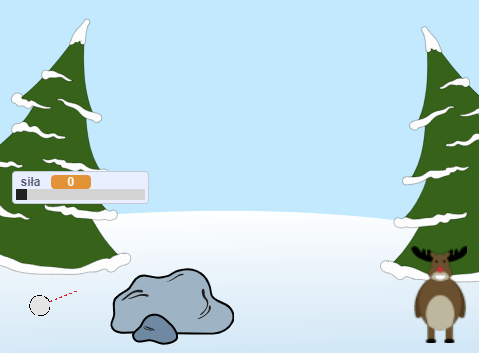

## Co dalej?

Spójrz na[Bitwa na śnieżki](https://projects.raspberrypi.org/en/projects/snowball-fight) Scratch project.

--- no-print ---

Użyj kursora myszy, aby ustawić kąt śnieżki i przytrzymaj przycisk myszy, aby wybrać moc kuli śnieżnej.

  <iframe allowtransparency="true" width="485" height="402" src="https://scratch.mit.edu/projects/embed/302159331/?autostart=true" frameborder="0" scrolling="no"></iframe>
  

--- /no-print ---

--- print-only ---

--- /print-only ---
