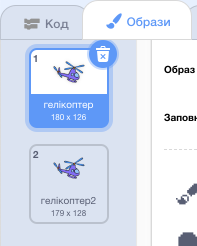
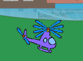

## Запуск гелікоптера

Давай запрограмуємо запуск гелікоптера, коли клацають на ноутбук.

--- task ---

Почнемо із оповіщення `старт`{:class="block3events"}, коли клацають на ноутбук. Тобі треба створити `нове повідомлення` з назвою `старт`.


```blocks3
when this sprite clicked
start sound (computer beeps1 v)
broadcast (старт v)
```

Цей код відправляє оповіщення всім іншим спрайтам. Якщо ти його протестуєш, то побачиш, що поки що нічого не відбувається! Це тому, що ти ще не запрограмував (-ла) гелікоптер реагувати на це повідомлення.

--- /task ---

--- task ---

Клацни на спрайт гелікоптера і додай блок `Коли я отримую`{:class="block3events"}. Будь-який код, прикріпленй до цього блоку, буде запущений, коли буде отримано повідомлення "старт" від ноутбука.


```blocks3
when I receive [старт v]
```

--- /task ---

--- task ---

Якщо ти клацнеш на вкладку "Образи" гелікоптера, то побачиш, що там є 2 образи із трохи різними пропелерами.



--- /task ---

--- task ---

Ти можеш використовувати ці 2 образи, щоб анімувати гелікоптер. Додай наступний код, щоб гелікоптер змінював образ нескінченно після того, як отримає повідомлення "старт".


```blocks3
when I receive [старт v]
+forever
next costume
end
```

--- /task ---

--- task ---

Протестуй свій код, клацнувши на спрайт ноутбука. Ти бачиш анімацію пропелера гелікоптера?



--- /task ---
