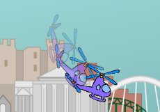

## Мертва петля

Давай запрограмуємо твій гелікоптер виконувати оберт на 360 градусів.

--- task ---

Ми хочемо, щоб гелікоптер робив оберт на 360 градусів, коли натискають на клавішу "пропуск". Пам’ятай, що числа в твоєму коді мають в сумі давати 360.


```blocks3
when [space v] key pressed
repeat (360)
turn ccw (1) degrees
end
```

--- /task ---

--- task ---

Протестуй свій код, натиснувши пропуск і ти побачиш, що гелікоптер повертається дуже повільно. Це тому, що він повертається лише на 1 градус 360 разів.

--- /task ---

--- task ---

Щоб прискорити обертання гелікоптера, зміни числа в коді, щоб він повертався на більшу кількість градусів меншу кількість разів. Не має значення які числа ти вибереш, головне щоб в сумі вони складали 360!


```blocks3
when [space v] key pressed
+repeat (45)
+turn ccw (8) degrees
end
```

--- /task ---

--- task ---

Якщо ти хочеш, щоб твій гелікоптер ще й рухався під час обертання, просто додай до свого коду блок `перемістити`{:class="block3motion"}.

```blocks3
when [space v] key pressed
repeat (45)
+ move (5) steps
turn ccw (8) degrees
end
```

--- /task ---

--- task ---

Знову натисни на пропуск, щоб протестувати свій код. Ти маєш побачити рух свого гелікоптера по колу. Що трапиться, якщо ти зміниш числа в блоці `перемістити`{:class="block3motion"}?



--- /task ---

