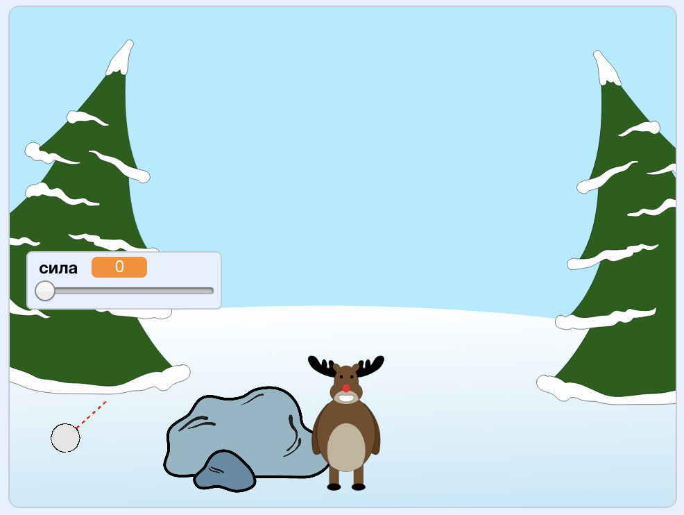

## Що далі?

Поглянь на проєкт Скретч [Гра в сніжки](https://projects.raspberrypi.org/en/projects/snowball-fight).

--- no-print ---

Використовуй вказівник мишки для вибору кута польоту сніжки і затримуй ліву клавішу мишки для задання сили.

  <iframe allowtransparency="true" width="485" height="402" src="https://scratch.mit.edu/projects/embed/302159331/?autostart=true" frameborder="0" scrolling="no"></iframe>
  

--- /no-print ---

--- print-only ---

--- /print-only ---
