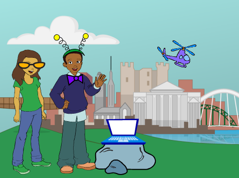

--- no-print ---

這個專案是 **Scratch 3** 版本。 另外還有 [Scratch 2](https://projects.raspberrypi.org/en/projects/tech-toys-scratch2) 版本。

--- /no-print ---

## 介紹

你將在本專案中學習如何製作你自己的高科技玩具。

### 你會做出的玩意兒

--- no-print ---

  <iframe allowtransparency="true" width="485" height="402" src="https://scratch.mit.edu/projects/embed/301514002/?autostart=false" frameborder="0" scrolling="no"></iframe>
  

+ 點擊領結來使其旋轉
+ 點擊太陽眼鏡來使其變色
+ 點擊筆記型電腦來啟動直升機
+ 使用方向鍵操控直升機
+ 按下空白鍵，讓直升機做翻跟斗飛行

--- /no-print ---

--- print-only ---

--- /print-only ---

--- collapse ---
---
title: 你需要什麼
---

### 硬體

+ 可運行Scratch 的電腦

### 軟體

+ Scratch 3（[線上版](http://rpf.io/scratchon){:target="_blank"} 或 [離線版](http://rpf.io/scratchoff){:target="_blank"}）

### 下載

入門專案[由此下載](http://rpf.io/p/en/tech-toys-go){:target="_blank"}。

--- /collapse ---

--- collapse ---
---
title: 你會學到
---

- 如何讓你的角色動起來
- 如何回應鍵盤輸入
- 了解廣播的工作原理

--- /collapse ---

--- collapse ---
---
title: 給教師的其它資訊
---

--- no-print ---

如果您需要列印此專案內容，請下載 [列印版本](https://projects.raspberrypi.org/en/projects/tech-toys/print){：target =“_ blank”}。

--- /no-print ---

你可以在這裡找到[已經完成的專案](http://rpf.io/p/en/tech-toys-get){:target="_blank"}。

--- /collapse ---
