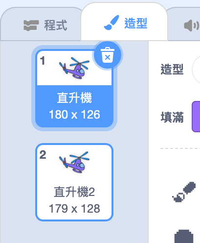

## 啟動你的直升機

讓我們對你的直升機進行編碼，使其在點擊筆記型電腦後啟動。

--- task ---

讓我們開始吧，透過點擊筆記型電腦，讓其廣播`開始`{:class=“block3events”}訊息。 你需要創建一個名為`開始`的`新消息` 。


```blocks3
when this sprite clicked
start sound (computer beeps1 v)
broadcast (start v)
```

這段程式碼向所有其他角色廣播一條訊息。 如果你測試這段程式碼，你將發現什麼都沒有發生！ 這是因為你尚未對直升機進行編碼來響應這個訊息。

--- /task ---

--- task ---

點擊你的直升機，然後添加`當收到訊息` {:class=“block3events”}積木。 當它收到來自筆記型電腦的“開始”訊息後，將運行任何附加到此積木的程式碼。


```blocks3
when I receive [start v]
```

--- /task ---

--- task ---

如果你點擊直升機的“造型”頁面，你會注意到它有兩個螺旋槳，這兩個螺旋槳的造型略有不同。



--- /task ---

--- task ---

你可以使用2個造型來為直升機設置動畫。 添加此代碼，來讓直升機在收到“開始”消息後能一直更換造型。


```blocks3
when I receive [start v]
+forever
next costume
end
```

--- /task ---

--- task ---

通過點擊筆記型電腦測試你的程式碼。 直升機的螺旋槳有動畫嗎？


--- /task ---
