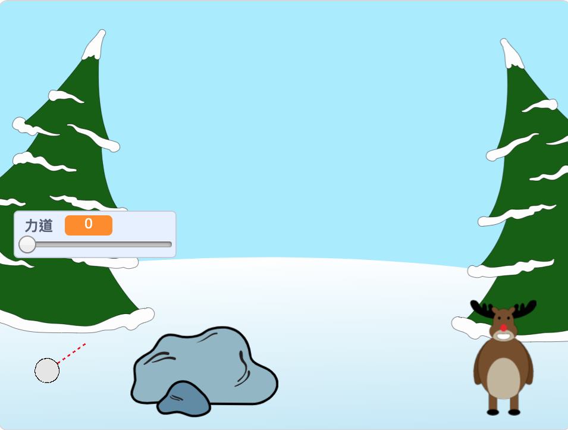

## 接下來呢？

看看 [打雪仗](https://projects.raspberrypi.org/en/projects/snowball-fight) Scratch專案。

--- no-print ---

使用鼠標來調整雪球的角度，然後按住滑鼠來控制雪球的力道。

  <iframe allowtransparency="true" width="485" height="402" src="https://scratch.mit.edu/projects/embed/302159331/?autostart=true" frameborder="0" scrolling="no"></iframe>
  

--- /no-print ---

--- print-only ---

--- /print-only ---
